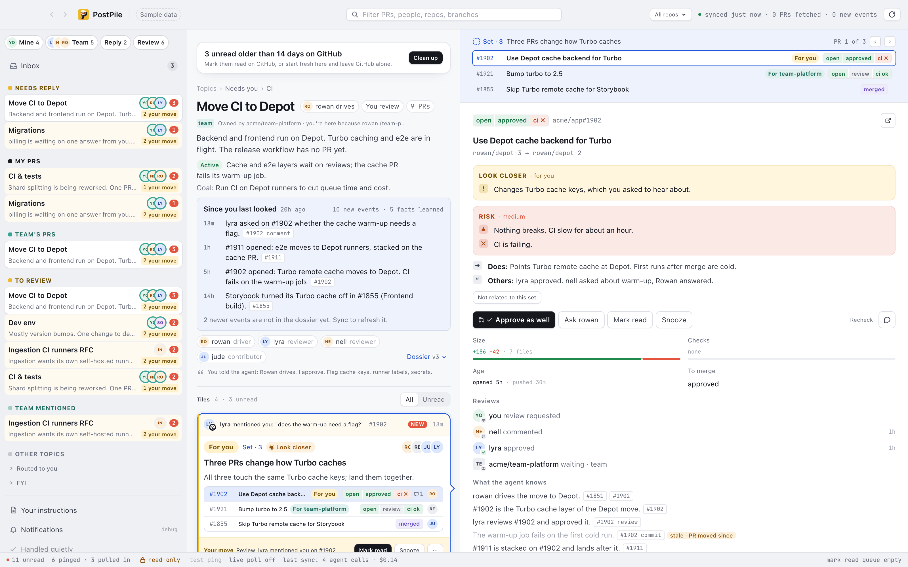

# PostPile

A macOS app that turns your GitHub pull request notifications into a short list of what needs you, and why.

> PostPile is an internal tool from PostHog's DevEx team, published as open source.
> It is not a PostHog product, and it has nothing to do with the PostHog platform.
> It is built for one DevEx workflow first: a busy monorepo, team review requests, and stacked pull requests.

PostPile is for engineers who get dozens of GitHub notifications a day.
It reads what GitHub pings you about and uses Claude to group the pull requests into topics.
Each pull request, stack, or set shows as a tile that answers four questions: for whom, why now, what state, and whose move.
You work from that list and the GitHub inbox stays in sync.



## The problem

- The GitHub inbox is a flat list sorted by time. A mention that needs your answer sits next to a bot comment on a pull request you merged last week.
- Team review requests, pushes after your approval, and CI noise all look the same.
- To find what is your move, you open each pull request and read its history.

## Quick start

```
brew install --cask posthog/tap/postpile
xattr -dr com.apple.quarantine /Applications/PostPile.app
open /Applications/PostPile.app
```

You need `gh` and `claude` logged in first (see [Install](#install)).
On the first start, a setup agent reads your recent pull requests and your repo's ownership files, guesses your team and your areas, and drafts your instructions for you to edit.
The first sync then takes a few minutes while the agent sorts your pull requests into topics.

## What it does

- Groups pull requests into topics and keeps a short dossier per topic. The agent proposes renames and merges, and you decide.
- Sorts topics into queues: Needs reply, My PRs, Team's PRs, To review, Team mentioned. A queue holds topics, not a flat list of pull requests.
- Shows whose move it is on every pull request. Deterministic rules (reviews, pushes, replies, stack order) decide first, and the agent judges only what the rules can't.
- Keeps a stack of pull requests together as one unit.
- Gives each pull request a short agent glance (verdict and risk) with sources you can check, recheck, or forget.
- Sends Mac notifications only for the pings that an agent judged worth it, from a poll every 10 seconds.
- Uses GitHub as the source of truth for read and unread. Writes (approve, comment, mark read) stay locked until you open the lock in the status bar.

**Status: alpha.** Its author uses it every day at PostHog. Expect rough edges, database migrations between versions, and features that fit that workflow first. The app is not notarized by Apple (see [First open](#first-open)).

## When not to use it

- You are not on an Apple silicon Mac. Only macOS arm64 builds exist.
- You don't want pull request text sent to Anthropic. The agent parts run through your `claude` CLI (see [Privacy](#privacy)).
- You get a handful of notifications a day. The GitHub inbox is enough then.
- You need support or a roadmap. This is an internal tool, maintained for its own team first.

## Install

Requirements:

- macOS 12 or later on Apple silicon (arm64)
- [GitHub CLI](https://cli.github.com) (`gh`), logged in: `brew install gh`, then `gh auth login`. Without it nothing syncs.
- [Claude Code](https://docs.claude.com/en/docs/claude-code) (`claude`), logged in: `curl -fsSL https://claude.ai/install.sh | bash`, then `claude auth login`. PostPile uses it for every agent call, on your own Claude plan or API key. Without it the app runs on rules only: tiles, whose turn and notifications work, and topics, dossiers, glances and chat do not.

With Homebrew:

```
brew install --cask posthog/tap/postpile
```

Or download `PostPile-<version>-mac-arm64.zip` from [Releases](https://github.com/PostHog/postpile/releases), unzip it and move `PostPile.app` to `/Applications`.

### First open

The app is ad-hoc signed. It is not signed with an Apple Developer ID and not notarized, so macOS blocks the first open. Do one of these:

- Clear the quarantine flag:

  ```
  xattr -dr com.apple.quarantine /Applications/PostPile.app
  ```

- Open the app once, then go to System Settings › Privacy & Security and click Open Anyway. On macOS 14 and older, right-click the app and choose Open.

On the first launch, macOS asks for permission to show notifications. The first sync takes a few minutes while the agent sorts your PRs into topics.

### Updating

```
brew upgrade --cask postpile
```

Then quit and reopen PostPile. When a new version is out, the app shows "Update available" in the title bar, with the release notes and this command.

## Troubleshooting

PostPile checks `gh` and `claude` on start. When one is missing, the window says what is wrong, shows the command to run, and has a Check again button. While something is wrong, the app checks again by itself every few minutes.

- **"GitHub CLI (gh) not found"**: run `brew install gh`, then `gh auth login`. Nothing syncs until then. Topics you already have stay.
- **"gh is not logged in"** or **"GitHub did not accept the gh login"**: run `gh auth login`, then click Check again. No restart is needed.
- **"Agent features are off: claude not found"** or **"claude is not logged in"**: install Claude Code (`curl -fsSL https://claude.ai/install.sh | bash`) and run `claude auth login`. Until then the app runs on rules only.
- **"Agent features are paused: Claude usage limit reached"**: the app tries the agent again when the limit resets. The rules keep working.
- **It works in a terminal but not from Finder**: a Finder launch gets a minimal PATH. The app does not run your shell to find the real one. It adds the folders from `/etc/paths` and `/etc/paths.d`, and looks in `/opt/homebrew/bin`, `/usr/local/bin`, `~/.local/bin` and `~/.claude/local`. For a binary somewhere else (mise, asdf, nix), add its folder to `~/.config/postpile/config.json` as `{ "toolPath": ["~/.local/share/mise/shims"] }` and restart the app. `POSTPILE_CLAUDE_BIN` still works for claude when started from a terminal. The log (Help › Reveal Logs) shows the PATH at start and every tool state change.
- **macOS asks for permissions** ("access data from other apps", "files in your Documents folder" and similar): the current alpha is ad-hoc signed, so macOS treats each update as a new app and old grants do not carry over. Since 0.1.0-alpha.1 the app no longer runs your login shell (which ran everything in your `.zshrc` in PostPile's name), runs `gh` and `claude` in its own empty folder, and the work context sweep stays out of Documents, Desktop, Downloads, iCloud, cloud drives, other apps' containers and `/Volumes`. You can deny such a prompt. To clear old entries, run `tccutil reset All com.posthog.postpile`.

## Privacy

PostPile runs on your Mac only. There is no PostPile server and no telemetry.

- **GitHub**: the app calls the GitHub API with the token from `gh auth token`. It reads your notifications and the PRs they point to. It writes (approve, comment, mark read) only after you unlock writes.
- **Anthropic**: agent calls run through the `claude` CLI on your machine, so PR titles, bodies, comments and review threads go to Anthropic under your Claude account's terms. GitHub text is treated as untrusted input: it is fenced in prompts, and calls that read it run without tools.
- **Work context sweep**: once a day the app reads your Claude Code folder (`~/.claude`: `CLAUDE.md` and its includes, each project's memory files, and light signals from the last 7 days of sessions), masks secrets, and asks Claude for a short digest of what you are working on. The digest helps rank and phrase things. Project folders on the skip list are never opened. The default list is `personal`, `private`. Your own list is edited under the digest and saved to `~/.config/postpile/config.json` as `{ "sweepSkip": ["taxes", "side-project"] }`; `POSTPILE_SWEEP_SKIP` (comma separated) wins over both. The digest shows under Your instructions, with its sources, and you can forget it.
- **Update check**: every 6 hours the app asks `api.github.com` for the latest PostPile releases, without a token, to show the update reminder. Turn it off with `POSTPILE_UPDATE_CHECK=0`.
- **Local data**: the database lives in `~/Library/Application Support/PostPile`, logs in `~/Library/Logs/PostPile`, and your instructions for the agent in `~/.config/postpile/instructions.md`.

## Development

To build from source, run the app in dev mode, or configure it with environment variables, see [docs/development.md](docs/development.md).
Contributors start with [CONTRIBUTING.md](CONTRIBUTING.md) and [AGENTS.md](AGENTS.md).
The spec is [DESIGN.md](DESIGN.md), and changes are in [CHANGELOG.md](CHANGELOG.md).

Your instructions for the agent live in `~/.config/postpile/instructions.md`. The app changes this file only through proposals you accept.

## Security

See [SECURITY.md](SECURITY.md). Report vulnerabilities to security-reports@posthog.com, not in public issues.

## License

[MIT](LICENSE). Copyright (c) 2026 PostHog Inc.
